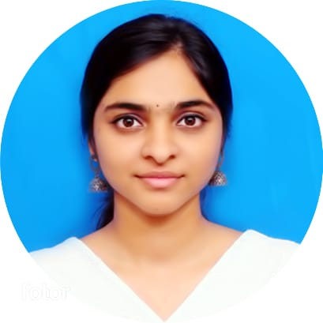

# Styled_Profile_Card
## Date:08.07.2025

## Objective:
To practice HTML and CSS fundamentals by designing a visually appealing profile card that demonstrates the use of background color, typography, spacing, and layout alignment techniques.

## Tasks:
#### 1. Create the HTML Structure:
Use ```<!DOCTYPE html>, <html>, <head>, and <body>``` to define the structure.
Add a ```<title>``` like "My Profile Card".

#### 2. Add Content:
Include name, title (e.g., Developer, Student), and a short bio using semantic tags such as ```<h1>```, ```<h2>```, and ```<p>```.

#### 3. Add a Profile Image:
Use the `````` tag to include a profile picture with appropriate alt, width, and height attributes.

#### 4. Apply Background Color:
Use a CSS class to style the card with a background color.

#### 5. Style Typography:
Use CSS to apply different font families, sizes, and text colors for the name and bio.

#### 6. Add Spacing:
Apply margin and padding to improve spacing between elements using CSS.

#### 7. Center the Card:
Use flexbox or margin: auto to center the card vertically and horizontally on the page.

#### 8. Add Hover Effects:
Enhance interactivity with simple hover effects like border changes or background transition using CSS.

## HTML Code:
```
<!DOCTYPE html>
<html lang="en">
<head>
  <meta charset="UTF-8">
  <link rel="stylesheet" href="style.css">

  <title>My Profile</title>
</head>
<body>

  <h1>Atchaya S</h1>
  <h3>Aspiring Full-Stack Developer | UI/UX Enthusiast</h3>
  

  <hr>

  <section>
    <h2>Contacts</h2>
    <p>+91 7207024677 <br>
    <a href="mailto:atchaya152005@gmail.com">atchaya152005@gmail.com</a><br>
    <strong>LinkedIn:</strong> <a href="https://www.linkedin.com/in/atchaya-s-4b7091255">atchaya-s-4b7091255</a><br>
    <strong>GitHub:</strong> <a href="https://github.com/AtchayaSundaramoorthy">AtchayaSundaramoorthy</a>
    </p>
  </section>

  <hr>

  <section>
    <h2>Objective</h2>
    <p>
      Enthusiastic Computer Science Engineering student with a growing foundation in software development, 
      focusing on full-stack web development and introductory machine learning concepts. 
      Looking to expand my skills and gain hands-on experience across different technology domains.
    </p>
  </section>

  <hr>

  <section>
    <h2>Education</h2>
    <p>
      <strong>B.E. in Computer Science Engineering</strong><br>
      Saveetha Engineering College, Chennai, India | 2022 - 2026<br>
      CGPA: 8.5
    </p>
    <p>
      <strong>High School & Higher Secondary School</strong><br>
      Alpha Matric Higher Secondary School, Chennai, India | 2020 - 2022<br>
      Percentage: 80%
    </p>
  </section>

  <hr>

  <section>
    <h2>Skills</h2>
    <ul>
      <li><strong>Programming:</strong> Java, Python, C++</li>
      <li><strong>Web Development:</strong> HTML, CSS, JavaScript, React</li>
      <li><strong>Databases:</strong> SQL, MongoDB</li>
      <li><strong>Tools:</strong> GitHub, VS Code, Android Studio, Figma, Autodesk Fusion 360</li>
      <li><strong>Soft Skills:</strong> Teamwork, Problem-Solving, Time Management, Leadership</li>
      <li><strong>Languages:</strong> English, Tamil</li>
    </ul>
  </section>

  <hr>

  <section>
    <h2>Experience</h2>
    <article>
      <h3>Web Development Intern - InternPe</h3>
      <p><em>November 2024 - December 2024</em></p>
      <p>Designed and developed responsive, user-centered websites using HTML, CSS, and JavaScript to enhance functionality and optimize design.</p>
    </article>

    <article>
      <h3>UI/UX Intern - RETECH Solutions Pvt Ltd</h3>
      <p><em>June 2024 - July 2024</em></p>
      <p>Redesigned an e-commerce app to enhance usability and engagement, applying design principles and UX research.</p>
    </article>
  </section>

  <hr>

  <section>
    <h2>Projects</h2>
    <ul>
      <li><strong>NLP-Powered Resume Parser:</strong> Flask app for skill extraction and job role matching using NLP (spaCy).</li>
      <li><strong>Crime360:</strong> Real-time crime alert platform with predictive analytics using Python and Flask.</li>
      <li><strong>E-commerce Mobile App Redesign:</strong> Improved user experience by redesigning the interface in Figma.</li>
      <li><strong>Covid-19 Death Prediction Model:</strong> Used ML techniques to predict COVID-19 death rates with Python.</li>
    </ul>
  </section>

  <hr>

  <section>
    <h2>Certifications</h2>
    <ul>
      <li>Introduction to Internet of Things - NPTEL, April 2024</li>
      <li>Google Cloud Career Launchpad Cloud Engineer Track - Google Cloud, June 2024</li>
      <li>Machine Learning - Simplilearn, April 2024</li>
      <li>Microsoft Azure AI Engineer Associate - Microsoft, April 2024</li>
      <li>Getting Started with MongoDB Atlas - MongoDB, September 2024</li>
      <li>Mobile App Development for Beginners - Simplilearn, April 2024</li>
    </ul>
  </section>

</body>
</html>
```
## CSS Code:
```

body {
  background-color: #f0f2f5;
  font-family: sans-serif;
  margin: 0;
  padding: 20px;
  color: #333;
  line-height: 1.6;
}

h1 {
  text-align: center;
  color: #2e3a59;
  font-size: 2.5rem;
  margin-bottom: 0.3em;
}

h3 {
  text-align: center;
  color: #586776;
  font-size: 1.3rem;
  margin-top: 0;
  margin-bottom: 1.5em;
}

h2 {
  color: #33475b;
  font-size: 1.6rem;
  border-left: 5px solid #b8d8e4;
  padding-left: 10px;
  margin-top: 2em;
}


img {
  display: block;
  margin: 0 auto 20px auto;
  border-radius: 50%;
  object-fit: cover;
  border: 4px solid #dfe6ed;
  box-shadow: 0 4px 12px rgba(0, 0, 0, 0.1);
}

section {
  background-color: #ffffff;
  max-width: 900px;
  margin: 30px auto;
  padding: 20px 30px;
  border-radius: 10px;
  box-shadow: 0 6px 16px rgba(0, 0, 0, 0.05);
}

p {
  font-size: 1rem;
  margin-bottom: 1em;
}

ul {
  list-style-type: disc;
  padding-left: 20px;
}

a {
  color: #2b7cff;
  text-decoration: none;
}

a:hover {
  text-decoration: underline;
}

hr {
  border: 0;
  height: 1px;
  background-color: #d9e2ec;
  margin: 40px auto;
  max-width: 80%;
}

article {
  margin-bottom: 25px;
}

img[alt="Profile picture"] {
  background-color: #e2e6ea;
  display: block;
  line-height: 200px;
  text-align: center;
  color: #a0a0a0;
  font-size: 14px;
}
```

## Output:


## Result:
A visually appealing profile card that demonstrates the use of background color, typography, spacing, and layout alignment techniques is designed.
